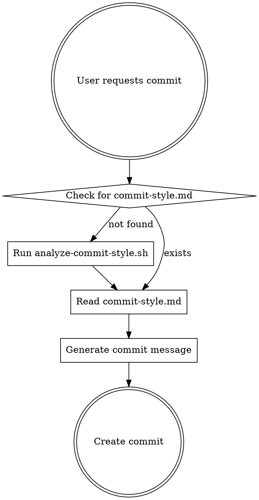

# Commit Style Enforcer

## Overview

This skill learns and enforces commit message conventions for any git repository. It analyzes commit history to detect patterns, caches the style guide, and helps generate consistent commit messages.

## When to Use

Use this skill when:
- Creating a new commit in any repository
- User asks for help writing a commit message
- You need to ensure commit messages follow project conventions

## How It Works



## Two-Step Process

### Step 1: Ensure Style Guide Exists

**Check for cached style guide:**

```bash
# Check if commit-style.md exists in skill directory
if [ -f "$HOME/.claude/skills/commit-style-enforcer/commit-style.md" ]; then
    echo "Found cached commit style guide"
else
    echo "No style guide found, analyzing repository..."
fi
```

**If missing, generate it:**

```bash
cd </path/to/skill/directory>
./analyze-commit-style.sh 15
```

This script:
- Analyzes last 15 commits (configurable)
- Detects tags, conventional commits, or custom patterns
- Identifies common verbs and message lengths
- Generates `commit-style.md` with discovered patterns

**Manual review (optional):**
After generation, review and refine `commit-style.md` if the auto-detection missed nuances.

### Step 2: Apply Style to Current Commit

**Analyze staged changes:**

```bash
git diff --staged --stat
git diff --staged
```

**Read the style guide:**

```bash
cat commit-style.md
```

**Generate commit message following the guide:**

1. Use tags/types from the style guide
2. Match common verb patterns
3. Keep first line under recommended length
4. Follow examples from the repository's history

**Create the commit:**

```bash
git commit -m "$(cat <<'EOF'
[tag] Your commit summary

Detailed explanation if needed.

Co-Authored-By: Claude Sonnet 4.5 <noreply@anthropic.com>
EOF
)"
```

## Script Reference

### analyze-commit-style.sh

**Location:** Same directory as SKILL.md

**Usage:**
```bash
./analyze-commit-style.sh [number_of_commits]
```

**Default:** Analyzes last 15 commits

**Output:** Creates `commit-style.md` with:
- Detected format style (bracketed tags, conventional commits, free-form)
- Common tags and their frequency
- Common starting verbs
- Average message length
- Real examples from the repository

**Re-run when:**
- Repository conventions change
- After major project milestones
- When style guide seems outdated

## Common Mistakes

### ❌ Skipping Style Detection

**Wrong:**
```bash
# Just guess the format and write commit
git commit -m "Update files"
```

**Right:**
```bash
# Always check for commit-style.md first
cat commit-style.md || ./analyze-commit-style.sh
# Then write commit following discovered patterns
```

### ❌ Using Generic Messages

**Wrong:**
```
Update user profile
- Various changes
- Bug fixes
```

**Right:**
```
[frontend] Add OAuth token refresh to user profile

- Implement automatic token refresh logic
- Handle expired token edge cases
- Update AuthConfig interface for refresh settings

This prevents session timeouts during long user sessions
and improves the authentication UX.
```

### ❌ Ignoring Repository Patterns

**Wrong:**
Using `feat:` in a repo that uses `[feature]` tags

**Right:**
Match the format detected in `commit-style.md`

## Validation Checklist

Before creating the commit:

- [ ] commit-style.md exists (or was just generated)
- [ ] Read the style guide
- [ ] Inspected staged changes with `git diff --staged`
- [ ] First line matches length recommendation
- [ ] Tags/types match repository patterns
- [ ] Verbs match common usage in the repo
- [ ] Detailed description explains **why**, not just **what**
- [ ] Message provides value to future developers
