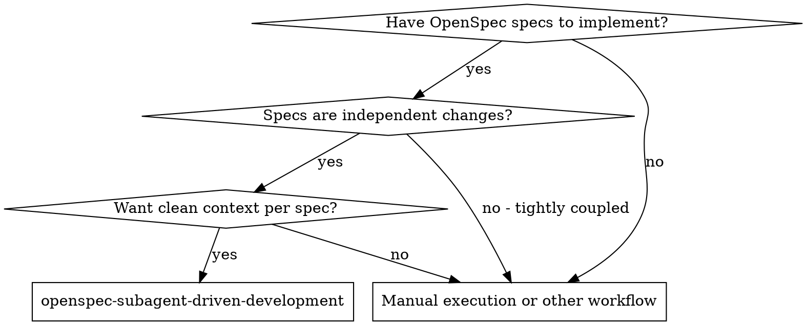
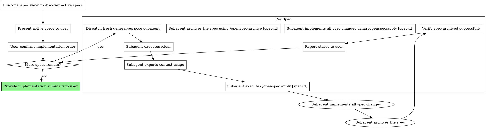

# OpenSpec Loop: OpenSpec Subagent-Driven Development

Implement OpenSpec specs by dispatching fresh subagent per spec, with clean context isolation and sequential execution.

**Core principle:** Fresh subagent per spec + sequential execution + clean context = high quality isolated implementation

## When to Use



**Key characteristics:**
- Sequential execution (one spec at a time)
- Fresh subagent per spec (no context pollution)
- Each subagent starts with `/clear`
- Spec archiving verifies completion

## The Process



## Subagent Instructions Template

When launching a subagent, provide it with these exact instructions:

```
You are implementing a specific OpenSpec change proposal. Your workflow:

1. FIRST ACTION: Execute `/clear` to ensure clean context
2. THIRD ACTION: Execute `/openspec:apply [spec-id]` to apply the spec you're implementing
3. Implement all changes described in the spec
4. After successful implementation, archive the spec
5. Report completion and terminate

Spec to implement: [spec-details]
```

## Example Workflow

```
You: I'm using OpenSpec Subagent-Driven Development to implement pending specs.

[Run 'openspec view' and parse active changes]
[Present list to user]

You: Found 3 active specs:
  1. add-base-image-uploads
  2. add-strapi-tag-creation
  3. some-other-feature

User: Implement in this order: add-base-image-uploads, then add-strapi-tag-creation

You: Confirmed. Starting implementation...

=== Spec 1: add-base-image-uploads ===

[Dispatch general-purpose subagent with spec details]
[Subagent executes /clear]
[Subagent exports context usage]
[Subagent executes /openspec:apply add-base-image-uploads]
[Subagent implements changes]
[Subagent archives spec]
[Verify archiving]

You: ✅ add-base-image-uploads completed and archived

=== Spec 2: add-strapi-tag-creation ===

[Dispatch fresh general-purpose subagent with spec details]
[Subagent executes /clear - completely fresh context]
[Subagent exports context usage]
[Subagent executes /openspec:apply add-strapi-tag-creation]
[Subagent implements changes]
[Subagent archives spec]
[Verify archiving]

You: ✅ add-strapi-tag-creation completed and archived

=== Summary ===

All requested specs implemented successfully:
  ✅ add-base-image-uploads
  ✅ add-strapi-tag-creation

Remaining: some-other-feature
```

## Advantages

**vs. Manual spec implementation:**
- Each spec gets dedicated, focused attention
- Fresh context per spec (no confusion from previous work)
- Automatic context usage tracking per spec
- Spec archiving confirms completion

**vs. Parallel implementation:**
- No context bleed between specs
- Sequential execution prevents conflicts
- Easier to debug if something goes wrong
- Clear progress tracking

**Quality benefits:**
- `/clear` ensures no mental contamination
- Each subagent starts fresh
- Failed specs don't affect subsequent specs
- Clean audit trail per spec

## Operational Constraints

**NEVER:**
- Read the specs directly yourself - always delegate to subagents
- Implement specs yourself - always delegate to subagents
- Allow context to bleed between spec implementations
- Skip the `/clear` action - it's critical for isolation
- Proceed without verifying spec archiving
- Implement specs in parallel - must be sequential
- Use "superpowers:subagent-driven-development" skill

**ALWAYS:**
- Verify spec exists and is valid before dispatching
- Verify spec is archived after completion
- Report failures and ask user how to proceed
- Maintain clear status display

## Error Handling

**If subagent fails to implement its spec:**
- Report the failure to the user
- Ask whether to: retry with new subagent, skip next spec, or abort
- Document the failure reason

**If spec cannot be applied:**
- Do not proceed to next spec without user confirmation
- Get explicit direction before continuing

## Progress Tracking

Maintain a clear status display showing:
- Total specs to implement
- Current spec being implemented
- Completed specs
- Remaining specs

Update after each spec completion.

## Integration

**Required workflow skills:**
- **openspec:apply** - Applies the spec to be implemented
- **openspec:archive** - Archives completed specs

**Related workflows:**
- **superpowers:subagent-driven-development** - Original task-based workflow (NOT for OpenSpec specs)

## Termination

Terminate after:
- All specs successfully implemented and archived
- User explicitly requests termination
- Unrecoverable error occurs and user chooses to abort
